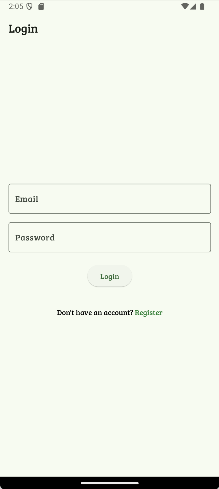
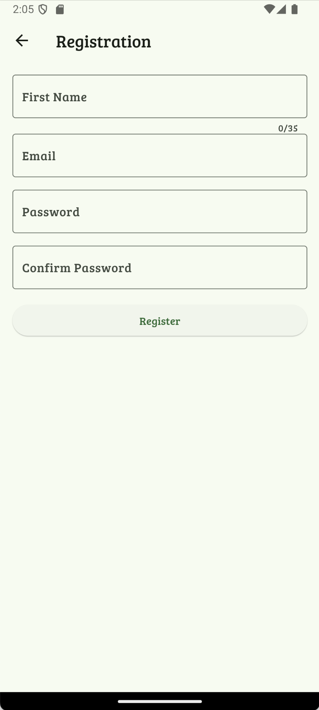
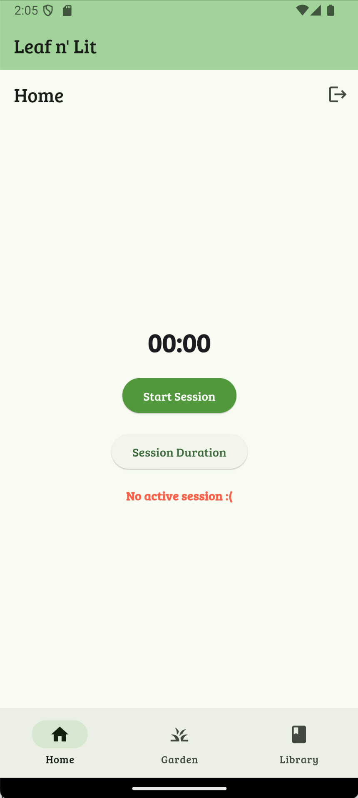
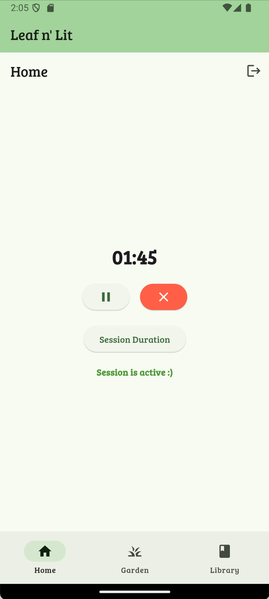
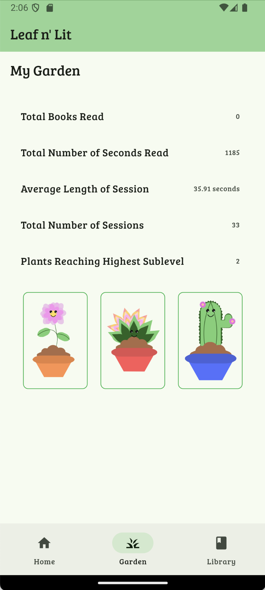
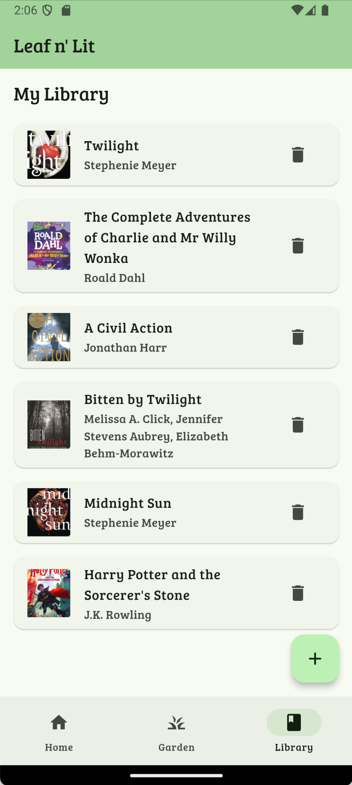
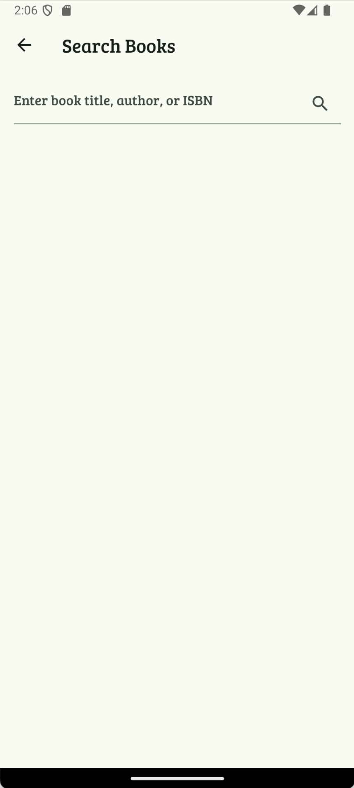
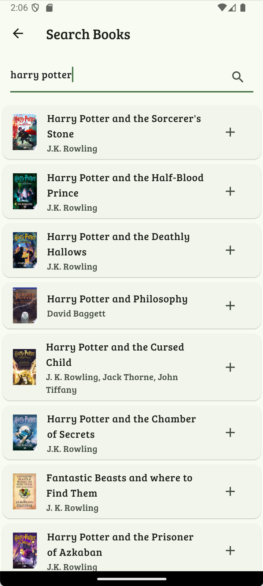

# Leaf n' Lit 🌱📚

A **Flutter** mobile app combining reading tracking with virtual plant care.

## Getting Started

1. Install Flutter development environment:
  - Follow the [Flutter Installation Guide](https://docs.flutter.dev/get-started/install)

2. Clone and setup:
  ```bash
  git clone https://github.com/jfelic/leaf-n-lit.git 
  cd LeafnLit
  flutter pub get
  ```

3. Run the app:
```bash
flutter run
```
## Features

### Reading Tracking
- Track reading sessions and stats
- Build your personal book library
- Search and add books via Google Books API

### Virtual Garden
- Earn plants through reading sessions
- Level up plants as you read more
- View garden progress and stats

### User System
- Create personal account
- Save reading data and garden progress
- Track individual reading statistics

## Screenshots
<table>
  <tr>
    <td></td>
    <td></td>
    <td></td>
  </tr>
  <tr>
    <td></td>
    <td></td>
    <td></td>
  </tr>
  <tr>
    <td></td>
    <td></td>
    <td></td>
  </tr>
</table>

## Technologies used
- Flutter/Dart
- Google Books API
- Firebase Authentication
- Firebase Firestore
